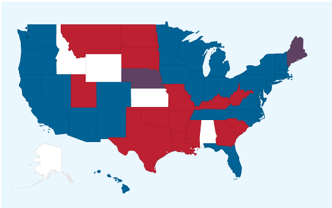
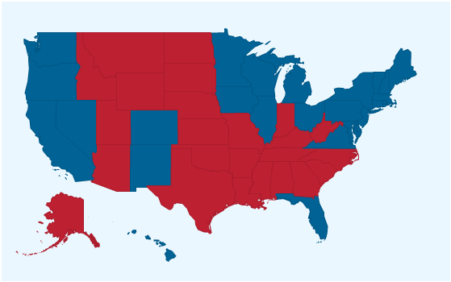

```{r echo=FALSE, warning=FALSE, message=FALSE}
############################
#Read in data
############################
library(stringr)
library(ggplot2)

today = as.Date("2012/11/05")
as.numeric.factor = function(x) {as.numeric(levels(x))[x]}


poll.ratings =  read.csv("https://raw.githubusercontent.com/fivethirtyeight/data/master/pollster-ratings/pollster-ratings.tsv", header=TRUE, sep="\t")
#head(poll.ratings)

nat.polls2012 = read.csv("2012_poll_data.csv", header=TRUE, sep="\t")
state.polls2012 = read.csv("2012_poll_data_states.csv", header=TRUE, sep='\t')

nat.polls2012$State = "USA"
polls2012 = rbind(nat.polls2012, state.polls2012)

#format dates
dates = str_split_fixed(as.character(polls2012$Date), " - ", 2)
polls2012$StartDate = as.Date(paste("2012", dates[,1], sep="/")) 
polls2012$EndDate = as.Date(paste("2012", dates[,2], sep="/")) 
polls2012$Date = floor(rowMeans(matrix(c(polls2012$StartDate, polls2012$EndDate), ncol=2)))
polls2012$Date = as.Date(polls2012$Date, origin="1970-01-01")

#format "spread"
polls2012$Spread = as.character(polls2012$Spread)
spread = str_split_fixed(polls2012$Spread, " ", 2)
obama = which(spread[,1] == "Obama")
polls2012$Spread[obama] = as.numeric(spread[obama,2])
polls2012$Spread[-obama] = -as.numeric(spread[-obama,2])
polls2012$Spread[which(is.na(polls2012$Spread))] = 0
polls2012$Spread = as.numeric(polls2012$Spread)

#format sample
polls2012$Sample = as.character(polls2012$Sample)
sample = str_split_fixed(polls2012$Sample, " ", 2)
polls2012$Type = sample[,2]
polls2012$Sample = as.numeric(sample[,1])


############################
#Weighted polling average
############################
#http://fivethirtyeight.com/features/how-fivethirtyeight-calculates-pollster-ratings/#fn-31
#find pollster-induced error

polls.beforetoday = which(polls2012$EndDate < today)
polldata = polls2012[polls.beforetoday,]
polldata$Poll = factor(polldata$Poll, levels=levels(poll.ratings$Pollster))
nax = which(is.na(polldata$Poll))
polldata = polldata[-nax,] #take out polls that haven't been rated by 538


#Calculating recency
#http://fivethirtyeight.com/features/how-the-fivethirtyeight-senate-forecast-model-works/#fn-13
daysfrom = as.numeric(difftime(as.Date("2012/11/01"), today, unit='days'))
recencyrate = log(2)/(14 + 0.2*daysfrom)
timedif = as.numeric(difftime(today, polldata$Date))

polldata$recency = exp(-recencyrate * timedif)


#Weighting by poll rating
polldata$rating = NA
for (i in 1:length(poll.ratings$Polls)){
  pollster = poll.ratings$Pollster[i]
  idx = which(polldata$Poll == pollster)

    polldata$rating[idx] = poll.ratings$Predictive.Plus.Minus[i]
}

polldata$Sample[which(is.na(polldata$Sample))] = 600 #538 policy


#Dataset and description of data can be found at
#https://github.com/fivethirtyeight/data/tree/master/pollster-ratings
polls = read.csv("https://raw.githubusercontent.com/fivethirtyeight/data/master/pollster-ratings/raw-polls.tsv", header=TRUE, sep="\t")
polls = polls[grep(pattern = ".*Pres.*", x=polls$race),] #select only polls for presidential elections
polls$polldate = as.Date(polls$polldate, format='%m/%d/%Y')
polls$electiondate = as.Date(polls$electiondate, format='%m/%d/%Y')

###################
#This was not included in the final predictions because  turns out that 
#the historical polling data I was using did not include all of the pollsters
#in the 2012 election. (I ended up using 538's pollster ratings on GitHub). 
#But I spent some time on it so I wanted to include it in the code to hand in.
##

polls$sample.error = 80 * polls$samplesize^-0.5
polls$PIE = polls$error - polls$sample.error
polls$IAE = NA 
polls$plus.min = NA 
n = length(polls$PIE)
for (i in 1:n){
  race = polls$race[i]
  others = polls[polls$race == race,]
  same = which(others$pollster == polls$pollster[i])
  others = others[-same,]
  polls$IAE[i] = ifelse(length(others$pollno != 0), mean(others$PIE), 0)
  polls$plus.min[i] = polls$PIE[i] - polls$IAE[i]
} 


se = sd(polls$IAE)/sqrt(length(polls$IAE)) 
pollsters = data.frame(pollster = levels(factor(polls$pollster)), PIE=NA, IAE=NA, plus.min = NA)
for (i in 1:length(pollsters$pollster)){
  pster = as.character(pollsters$pollster[i])
  pollsters$PIE[i] = mean(polls$PIE[polls$pollster == pster])
  pollsters$IAE[i] = mean(polls$IAE[polls$pollster == pster])
  
  pollsters$plus.min[i] = mean(polls$plus.min[polls$pollster == pster])
  
}
#this is basically comparison to methodologically perfect poll
pollsters$plus.min = pollsters$plus.min + 1.49

###################


for (i in 1:length(polldata$Poll)) {
  pster = as.character(polldata$Poll[i])
  tot.error = poll.ratings$Simple.Plus.Minus[poll.ratings$Pollster == pster] + 1.49 + 80*polldata$Sample[i]^-0.5
  ESS = 6400 * (tot.error^-2) #effective sample size
  polldata$rating[i] = ESS/283
}


#statepollsters
#going backwards in time
#calculate cumulative effective sample size (most recent, then most recent + second most, etc)
#difference b/w CESS is the marginal and treated as actual sample size

#Weighting by sample weight
polldata$Sampleweight = sqrt(polldata$Sample/600)
#http://fivethirtyeight.com/features/polls-now-weighted-by-sample-size/


##########################
##Likely Voter adjustment
##########################

rv = which(polldata$Type == "RV")
polldata$spread[rv] = polldata$spread[rv] - 2.7
#registered voter polls tend to differ from likely voter polls by 2.7 percentage points


##########################
##Trend Line Adjustment
##########################
#Create "week" variable
#Week is defined using "today"
polldata$Week = today - 7*floor(difftime(today, polldata$Date, unit='days')/7)

polldata$week = as.numeric(floor(difftime(today, polldata$Date, unit='days')/7))

polldata$StatePollster = paste(polldata$State,polldata$Poll)


statepollsters = data.frame(StatePollsters = as.character(levels(factor(polldata$StatePollster))))

polldata$TAdjustment = NA
trend.fits = lapply(statepollsters$StatePollsters, function(x){
  data = polldata[polldata$StatePollster == x,]
  fit = NA
  if (length(data$Poll) < 5) {
    0
  }
#  if (length(data$Poll) < 10){ #apparently changing this to ifelse breaks lapply
#    fit = lm(Spread ~ week, data=data)
#    predict(fit, newdata=data.frame(week = 0)) - predict(fit, newdata=data)
#  }
  else {
    fit = loess(Spread ~ week, data=data, span=0.85, model=TRUE, surface='direct')
    predict(fit, newdata=data.frame(week = 1)) - predict(fit, newdata=data)
  }
})


for (i in 1:length(statepollsters$StatePollsters)) {
  polldata$TAdjustment[polldata$StatePollster == statepollsters$StatePollsters[i]] = trend.fits[[i]] #apparently doing this inside lapply breaks R
}

polldata$TAdjusted = polldata$TAdjustment + polldata$Spread
```

Nate Silver made waves in the 2008 election when he correctly forecasted the outcomes of 49 out of 50 of the states using statistics. Many doubted that he would be able to replicate his success for the 2012 presidential election, but he not only did as well as last time, he improved on his methodology and correctly forecasted all 50 states. For this project, I attempted to replicate his predictions for the 2012 election, using the methodology described on his blog [1]. 

Nate Silver's method is based on the idea that general election polls are related to the outcome of the election, and can be used to create a prediction of the election's result. If we view the election results as a random variable, we can use the polls to define an expected value for the election's outcome, and the uncertainty associated with the polls as the variance. 

A simple aggregated poll average would not be enough to create a prediction because not all polls are created equal--some are more accurate due to methodology, others due to sample size. Some polls may be from a long time ago, and therefore from a different political landscape and thus less applicable to the current political landscape. A good model should account for all of these factors in the data. A large part of Nate Silver's process is adjusting and weighting the polls for the election to account for these factors.

He first collects poll data and weights each poll based on its recency, sample size, and a rating that he creates for the pollster who conducted the poll, based on the pollster's historical accuracy in predicting elections. This way, more recent polls are given more weight, as are polls with larger sample sizes. 

He then adjusts the poll results so that they are comparable. For example, a certain pollster may have a liberal tendency, and on average give 2 percentage points more to the Democrat than other polls. This pollster's polls would then be adjusted 2 points toward the Republican party. This "house effects" difference is one of three factors Nate Silver considers when adjusting the poll results. The other two are whether the poll sampled from likely voters or registered voters and the overall political mood at the time the poll was taken.

After completing these two steps, I used the adjusted, weighted polling average to create a prediction for the outcome in each state. Due to time constraints, I did not get to include each state's political partisanship,  the nation's economy, or other factors such as each candidate's partisan index in my prediction, and I was not able to quantify the uncertainty associated with the polls. This heavily affects the interpretation of my results, compared to Nate Silver's projections, because although I have provided an estimate of the eleciton's outcome, I cannot say how good that estimate is.

To replicate Nate Silver's results, I used his dataset of pollster ratings, found at https://github.com/fivethirtyeight/data/tree/master/pollster-ratings, and a CSV file of general election polls from 2012 found on https://github.com/jseabold/538model. 

#Weighted Polling Average
##Recency
Polls are weighted according to how recent they are, using an exponential decay function $exp{-\lambda t}$, where t is the number of days since the poll was conducted, and $\lambda$ is chosen so that the half-life of the poll is $14 + 0.2*\text{daysfrom}$, where $\text{daysfrom}$ is the number of days between the current day and the election. The result is that, for example, a poll from two weeks ago is penalized more the closer the date is to the election.

##Sample size
Polls are weighted by $\sqrt{Sample Size/600}$, where 600 is the most common poll sample size. The effect is an asymmetric weighting, so that polls with much smaller sample sizes are penalized heavily, but polls with much larger sample sizes do not benefit much. 

##Pollster rating
Polls are weighted according to how well the pollster has performed in the past. "How well" the pollster has performed is calculated by taking the average of errors under the pollster's control. [2]

There are three sources of error in a poll: sampling error, temporal error, and methodology errors (what he calls "pollster-induced error", or PIE). Temporal error is incorporated into the model as uncertainty while creating the forecast for the election, based on information available today. Furthermore, the polls he based the ratings on were all taken within two weeks of the election date, and so temporal error can be considered negligible. Approximating sampling error, using the formula $80 * n^{-0.5}$, then allows us to calculate PIE for any poll. 

The PIE of all other polls in the same contest, by a different pollster, are then averaged together to get an "iterated average error" (IAE). For simplicity, I compared the PIE for each poll to all other polls in the same contest, regardless of pollster. The IAE is then subtracted from the PIE to get an idea of how accurate this poll is, compared to the average (called the "+/- rating). A negative +/- rating means the pollster's error is on average lower than other pollsters. 

To turn the +/- rating into a weight for each pollster, the +/- rating is first averaged over all polls conducted by the pollster, "regressed to the mean", then added to the average pollster PIE to get a sense of the absolute value of the error to get the long-run PIE. For simplicity's sake, I did not regress the +/- rating to the mean.

To translate the long-run PIE into weightings that are on the same scale as the weight given to polls for sample sizes, we can look at these ratings as measures of the effective sample size (ESS). Adding the long-run PIE of a pollster to the sampling error of a poll gives us the total expected error for that poll. We can then ask how large a methodologically perfect poll would have to be to get the same total expected error, using the equation $Effective Sample Size = 6400 * (Total Expected Error)^-2$.

For example, a poll with 500 respondents and a long-run PIE of 0.88 has total expected error of 4.46. The effective size of this poll is $6400 * 4.46^2$, or 322. 

We use the effective sample sizes to create the weight. Silver defines a poll as having a pollster weighting of 1 if it has 600 respondents and has average long-run PIE (1.49). Such a poll would have an effective sample size of 283. The ratio of a poll's effective sample size over the average poll's ESS is the poll's pollster weighting. 

I did calculate the long-run PIE based on the historical data I had, but that did not include data on all the pollsters that were in the 2012 election, so I used the +/- ratings for pollsters on FiveThirtyEight's GitHub and used those to calculate the long-run PIE, and thus the pollster weightings for each poll.


#Adjustments to Poll results
##Registered Voters adjustment
Polls are typically either registered voter polls, meaning they sample from all registered voters, or likely voter polls. Likely voter polls tend to be more accurate and, on average, lean 2.7 percentage points more in favor of Republicans than registered voter polls. The results for all registered voter polls are then adjusted 2.7 percentage points towards Republicans.

##Trendline adjustment
In the time between the day a poll was taken and the election date, it is very likely that the political landscape will change (such as one candidate performing extremely well at a debate, thus shifting public opinion towards him). Older polls, therefore, are less relevant today because they come from a different political landscape. The trendline adjustment seeks to account for that. 

The polls are split into groups based on the state they were conducted in (national polls are considered part of the "USA" state) and their pollster. A LOESS regression is conducted on each pollster-state subgroup, with the polls' results as the response, the week as the predictor, and smoothing parameter 0.85. The week is defined starting from the current date--the 7 days before today are week 1, the preceding 7 are week 2, and so on. [3] Poll results are numbers, with positive numbers indicating a percentage point lead in favor of Obama, and negative indicating a lead in favor of Romney.

This is analagous to a linear regression with model $Result_i =  beta_0 + \beta_1*Pollster_i*State_i + \beta_2*Week_i + \epsilon_i, \epsilon~N(0,\sigma^2)$. 

Some pollster-state subgroups had very little data. I originally fit a linear regression to the subgroups with under 0 data points, but found that this unrealistically skewed poll results. Instead I did not fit a model to subgroups with fewer than 5 data points. 

The result is a regression that represents the average results of a pollster within a state, over time. I used the predict function in R to estimate the difference between the pollster's average results now, and at the time of each poll, and then adjusted the polls' results accordingly. For example, if state/pollster unit A was giving Romney an average lead of 1 percentage point 5 weeks ago, as calculated by the model, and was today giving Obama an average lead of 0.5 percentage points, I would shift all of the polls' results from 5 weeks ago towards Obama by 1.5 percentage points.

However, the trend line adjustment can become unrealistic if there isn't any recent poll data for a state/pollster unit. If the most recent poll for a state/pollster subgroup is from 5 weeks ago, extending the LOESS regression line can result in a swing of over 10 percentage points in either direction. 

##House effects adjustment
Pollsters may have a tendency to produce polls that favor one party over the other, called "house effects." In Nate Silver's model, the "house effect" of a pollster is defined as how much the pollster favors a party, compared to other pollsters (not compared to the election result). 

The house effects of the pollsters are determined using a linear regression, with pollsters and states as predictors (states are included to account for state biases). The model is $TAdjusted_i = \beta_0 + \beta_1*State_i + \beta_2*Pollster_i + \epsilon_i, \epsilon~N(0,\sigma^2)$, where TAdjusted is the poll's results, adjusted as described previously. The vector of coefficients $\beta_2$ and the 90% confidence interval of $\beta_2$ are used to calculate house effects for each pollster.  

Some states and pollsters were perfectly collinear, meaning that the pollster did not poll in any other states, and the state did not have any polls from any other pollster. I removed those states (Oklahoma, Lousiana, and Arkansas) from the model. After removing those states, the variance inflation factors for each predictor was very near to ideal at 1.183795 for State and 1.095294 for Poll.

```{r echo=FALSE, warning=FALSE, message=FALSE}
#################
##House effects adjustment
#################

#remove polls with only one poll per state 
library(reshape2)
s = state.abb
s[51] = "USA"

count.states = dcast(polldata, State + Poll ~., length) 
#WV, TX, SD, OK, MS, MD, HI, LA, KY, IL, HI, AR
#OK Soonerpoll.com, LA Clarus, AR Hendrix


count.polls = dcast(polldata, Poll  ~., length)
singleton.idx = which(count.polls$. == 1) #states with polls conducted by only one pollsters

ok.idx = which(polldata$State == "OK" )
la.idx = which(polldata$State == "LA" )
ar.idx = which(polldata$State == "AR" )

housefx.fit = lm(TAdjusted ~ State + Poll, data=polldata[-c(ok.idx, la.idx, ar.idx),])

library(car)
vif(housefx.fit)
```

A plot of the residuals looks linear in mean. There is what looks like a potential outlier that is very separated from the rest of the residuals.

```{r echo=FALSE, warning=FALSE, message=FALSE}
res = housefx.fit$residuals
plot(housefx.fit$fitted.values ~ res, xlab="Residuals", ylab="Fitted values", main="Residuals vs Fitted Values")
```

A Bonferroni-p outlier test did find a potential outlier in the data, but a graph of the Cook's distance for the fit showed that no points were particularly influential. In fact, removing the outlier does not change my prediction results.

```{r echo=FALSE, warning=FALSE, message=FALSE}
outlierTest(housefx.fit) #744, 748, 746, 743, 745


cd=cooks.distance(housefx.fit)
plot(cd)

outlier = which(res == max(res))
```

A Q-Q plot of the residuals shows that the data violates the assumption of normality in the tails. In this case, the dataset is large enough that this is not as much of an issue, due to the Central Limit Theorem. The linear model does then seem reasonable.  

```{r echo=FALSE, warning=FALSE, message=FALSE}
qqnorm(res)
qqline(res)
```

The coefficients for each pollster from the model represent that pollster's house effect. However, simply removing house effects from the model, by subtracting the coefficient from the poll's adjusted results, may flatten the field too much and remove some of the advantages of aggregating polls. To counteract this, Nate Silver calculates a "buffer" for each pollster which is kept in the model. 

The buffer is the 90% confidence interval associated with each coefficient. To adjust polls' results to account for house effects, the buffer for each pollster is removed from the pollster's house effect (coefficient in the model). The difference is then used to adjust that pollster's poll results. 

For example, if Pollster A has a coefficient of 3.5 and a buffer of 2, the pollster's adjusted house effect would be 3.5 - 2 = 1.5. The house's poll results are then adjusted by 1.5 percentage points towards Romney. 

```{r echo=FALSE, warning=FALSE, message=FALSE}
library(Matrix)
housefx = summary(housefx.fit)


##Use coefficients as house effect and 90% CI as "buffer" for house effect
hfx = housefx$coefficients[-seq(1,42,1),1]
se = housefx$coefficients[-seq(1,42,1),2]

X = model.matrix(housefx.fit)
p = rankMatrix(X)
p = p[1]

buffers = 2*se * qt(0.95, n - p)
housefx = data.frame(Poll = names(hfx), HouseEffect = as.numeric(hfx), Buffer = as.numeric(buffers))
names = str_split_fixed(housefx$Poll, "Poll", 2)
housefx$Poll = names[,2]

housefx$Total = ifelse(housefx$HouseEffect < 0, housefx$HouseEffect + housefx$Buffer, housefx$HouseEffect - housefx$Buffer)

polldata$HXAdjusted = polldata$TAdjusted
for (i in 1:length(polldata$Poll)){
  pster = as.character(polldata$Poll[i])
  total.hfx = housefx$Total[housefx$Poll == pster]
  if (length(total.hfx != 0)) {
    #length of total.hfx will be 0 if it was a poll conducted by a pollster
    #who only has polls in one of the states that were taken out
    polldata$HXAdjusted[i] = polldata$TAdjusted[i] - total.hfx
  }
}


#use coefficients of housefx as housefx
#depending on sign of housefx:
#   - neg housefx: add buffer, subtract the sum from TAdjusted
#   - pos housefx: subtract buffer, subtract the sum from TAdjusted (I think)


#################
##2012 predictions
################

#http://fivethirtyeight.com/features/how-the-fivethirtyeight-senate-forecast-model-works/#fn-13
#multiply final adjusted spread by all weights and then average over each state
#in Maine and Nebraska, average over congressional district?


elect.votes = read.csv("electoral_votes.csv")
elect.votes$State = as.character(elect.votes$State)
elect.votes$StateAbb = NA
for (i in 1:51){
  idx= which(state.name == elect.votes$State[i])
  if (length(idx) != 0){elect.votes$StateAbb[i] = state.abb[idx]}
  else {elect.votes$StateAbb[i] = "DC"}
}
#head(elect.votes) #number of votes for each state

predicted.votes = data.frame(State = elect.votes$StateAbb, Votes = 0, region=tolower(elect.votes$State))
#head(predicted.votes)

for (i in 1:51){
  if (elect.votes$StateAbb[i] == 'DC') {
    nationaldata = polldata[polldata$State == 'USA',]
    spread = nationaldata$HXAdjusted
    pop.vote = mean(spread * nationaldata$Sampleweight * nationaldata$recency * nationaldata$rating)
    predicted.votes$Votes[i] = ifelse(pop.vote > 0, elect.votes$Votes[i], 0)
    
  }
  else {
    statedata = polldata[polldata$State == elect.votes$StateAbb[i],]
    spread = statedata$HXAdjusted 
    pop.vote = mean(spread * statedata$Sampleweight * statedata$recency * statedata$rating)
    if (elect.votes$StateAbb[i] == 'ME' | elect.votes$StateAbb[i] == 'NE'){
      obama.perc = pop.vote + 50
      predicted.votes$Votes[i] = round(obama.perc/100 * elect.votes$Votes[i])
    }
    else {
      predicted.votes$Votes[i] = ifelse(pop.vote > 0, elect.votes$Votes[i], 0)
    }
  }
}

suppressPackageStartupMessages(library(googleVis))

all_states = map_data("state")
##These values are so the right colors are assigned instead of a gradient
predicted.votes$Obama = ifelse(predicted.votes$Votes > 0, 0, 1)
predicted.votes$Obama[c(20,28)] = 0.5
predicted.votes$Obama = ifelse(is.na(predicted.votes$Votes), 2, predicted.votes$Obama)


map = gvisGeoMap(data.frame(state = predicted.votes$region, outcome = predicted.votes$Obama), locationvar='state', numvar='outcome', options=list(region='US',dataMode='regions',colors="['0x006295','0xBD2031', '0xFFFFFF']", showLegend = FALSE))
plot(map)

elect.votes$actual = c(0,0,0,0,55,9,7,3,3,29,0,4,0,20,0,6,0,0,0,4,10,11,16,10,0,0,0,0,6,4,14,5,29,0,0,18,0,7,20,4,0,0,0,0,0,3,13,12,0,10,0)
elect.votes$Obama = ifelse(elect.votes$actual > 0, 0, 1)
elect.votes$Obama = ifelse(is.na(elect.votes$actual), 2, elect.votes$Obama)

actual.map = gvisGeoMap(data.frame(state = elect.votes$State, outcome = elect.votes$Obama), locationvar='state', numvar='outcome', options=list(region='US',dataMode='regions',colors="['0x006295','0xBD2031']", showLegend = FALSE))
plot(actual.map)

predicted.votes$actual = elect.votes$actual

predicted.votes$error = predicted.votes$Votes - predicted.votes$actual != 0

err.idx = which(predicted.votes$error)
predicted.votes$State[err.idx]

polldata[polldata$State == 'IN',]
#AZ IN ME NE NC TN


```

#State Fundamentals
In this stage, Silver includes non-polling data from each state that has historically shown to have predictive power. This includes:
  * National polls (indicates the overall partisan mood in the country)
  * Approval ratings
  * Fundraising totals
  * Whether one of the candidate is an incumbent
  * Highest political office held by each candidate
  * Candidate ideology (by aggregating ideology scores from three systems)
  * State partisanship (by looking at a state's presidential results relative to the national average and congressional races)

The state fundamentals can help predict results in, for example, purple states, where it matters less whether a candidate is Republican or Democrat, and more how far they are from the national center. They are also helpful for states with very little polling.

The state fundamentals estimates are thought of as equivalent to polls. Each state's state fundamentals estimate is included in the final aggregated result as a poll with some weight between 0.35 and 1, where 1 is equivalent to the average poll with a sample size of 600. (I could not find the actual weight for presidential elections on his site. 0.35 is the weight for state fundamentals for Senate elections, where the state fundamentals do not matter as much.) 

I did not include state fundamentals in my prediction.

#Now-Cast, Election Day Forecast, Estimation of Margin of Error

I did not include these steps in my prediction.

##Now-Cast
Silver averages over all of the adjusted poll results, with weights as calculated, and the state fundamentals to produce a prediction of election results if they were to happen today. 

##Election Day Forecast
Silver uses the now-cast to calculate a projection of election day results based on an economic index. The economy, as it is perceived by voters, is one factor that historically has shown to affect results. If the economy is seen as doing well, the country's partisan mood turns toward the party that is currently in power. If the economy is doing poorly, the other party is more favored. 

##Estimation of Margin of Error
Silver calculates a prediction interval for the election day forecast using a linear regression on past forecasts and the factors which are historically correlated with errors in the forecast. Those factors are:
*  Days left until the election
* Number of polls
* Percentage of polls for each state that agree with each other
* Whether the polling average agrees with the state fundamentals estimate
* Number of third-party or undecided voters
* Whether the race is strongly in favor of one candidate. Counterintuitively, the model is less accurate when one candidate is shown to be the heavy favorite, perhaps because voters for that candidate do not feel the need to go vote.

##Simulation of outcomes
The election day forecast provides a mean and the estimated margin of error provides a variance. He then simulates the results using Fleishman's transformation of the normal. 

His reasoning for simulating the results is that errors in polls are not necessarily independent from state to state. The margin of error can then be split into a national error and a state-specific error. The simulation is necessary to see how different values of national error and state-specific errors change the results. 

The simulation first randomly generates a number that represents national error, then randomly generates state-specific errors for each state. The numbers are added to the average result to produce a simulated result for each state. 

The results from thousands of simulations are then counted to give a probability distribution, which is used to predict the probability of a candidate winning.

#Prediction
Instead of calculating a now-cast and then projecting the result onto the election date, I took "today" to be the day before the election and considered all polls taken before the election date. 

I took the average of each poll's results for each state, weighted and adjusted as described previously If the average was in favor of Obama, I added the electoral votes for that state to a running total that I creatively named predicted.votes. 

Two states, Maine and Nebraska, split their electoral votes for each party based on their congressional districts. Due to a lack of data, I simply turned the average poll result into a ratio, then multiplied the ratio by the number of electoral votes for the state, to get the number of votes for each candidate.

Polls for Washington D.C. were not included in my dataset, surprisingly, so I used the results from national polls instead, with the idea that they represent the average result, to determine where the electoral votes for D.C. would go.

Results are shown in the map below, with states won by Obama in blue and states won by Romney in red. States that were split (Maine, Nebraska) are in purple. White states are states that I did not have data for.



Compared to a map of the actual election results below, we can see that five of the states were predicted incorrectly: Arizona, Indiana, Maine, Nebraska, North Carolina, and Tennessee.



Maine and Nebraska were incorrect because I based the electoral college vote allocation off of their popular vote, when in reality all congressional districts in both states voted the same. (Obama won all of Maine, while Romney won all of Nebraska.)

What is interesting are the other states that were predicted incorrectly. Most of the polling data I had for Arizona, Tennessee, and Indiana was old--at least over six weeks old. That means that when the trend line adjustment was calculated, the LOESS regression was calculating an expected value for six weeks from the most recent poll date, leading to an inflated trend line adjustment, which actually swung the results of some of the more recent polls in the opposite direction.

In the case of North Carolina, the polls show inconsistent small leads for Obama or for Romney. This is one case where calculating the state fundamentals may have been helpful (and on Nate Silver's website, he mentions that the state fundamentals estimate did better than the polling average in the 2012 presidential election). 

hat did not help matters is that it turns out that all of the polling data was encoded with the year 2012, but some of the polls for North Carolina were actually from late 2011 (I checked this by looking up the polls on RealClearPolitics.com). These polls from October of 2011 were heavily in favor of Romney, but over the course of the year, the polls swung to be  in favor of Obama. But since the October 2011 polls were seen as fresh polls, within a few weeks of the election date, they were given as much weight, or more, than the polls in favor of Obama.

Overall, the polling average that I calculated did much better than I expected, particularly once I found out how some of the polls were encoded with the entirely wrong year. Including factors external to the polls, such as state fundamentals, would have made the prediction better.

******

[1] How The FiveThirtyEight Senate Forecast Model Works | FiveThirtyEight. (n.d.). Retrieved December 10, 2015, from http://fivethirtyeight.com/features/how-the-fivethirtyeight-senate-forecast-model-works/#ss-55
[2] Pollster Ratings v3.0 | FiveThirtyEight. (n.d.). Retrieved December 10, 2015, from http://fivethirtyeight.com/features/pollster-ratings-v30/
[3] We know more than we think (Big Change #2) | FiveThirtyEight. (n.d.). Retrieved December 10, 2015, from http://fivethirtyeight.com/features/we-know-more-than-we-think-big-change-2/


